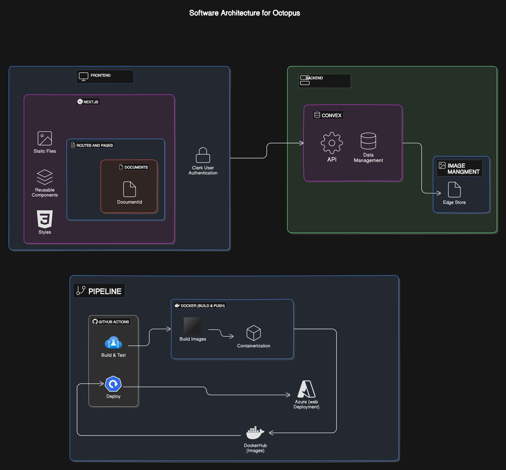

# Octopus

Welcome to Octopus! My goal is to create a sophisticated notes-taking application that simplifies document management with nested structures. Whether you're organizing personal notes or collaborating on complex projects, Octopus is designed to streamline your workflow with real-time updates and intuitive features.

### Technology Stack

- **Client Side**: React with TypeScript
- **Server Side**: Next.js,
- **Real-time Database**: Convex ([Convex Documentation](https://docs.convex.dev/home))
- **Authentication and Authorization**: Clerk ([Clerk Documentation](https://clerk.com/docs))
- **File Management (for image uploads)**: EdgeStore ([EdgeStore Documentation](https://edgestore.dev/docs/quick-start))
- **CI/CD**: Github Actions - Docker - Azure

---

### Demo (https://myoctopus.azurewebsites.net)


---

### Software Architecture




---

### CI/CD Pipeline

This project employs a robust CI/CD pipeline using GitHub Actions, Docker, Docker Hub, and Azure Web App for seamless deployment:

1. **GitHub Actions**: Automates the build and test processes triggered by pushes to the `main` branch and pull requests. It ensures code quality and prepares the application for deployment.
2. **Docker**: Utilizes Docker for containerization, encapsulating the application and its dependencies into a portable container image.
3. **Docker Hub**: Hosts the Docker images, providing a centralized repository from which the application can be deployed to various environments.
4. **Azure Web App**: Deploys the Dockerized Octopus application to Azure Web App, ensuring scalability and reliability. Azure Web App allows for easy management of the application's lifecycle, scaling options, and seamless integration with Azure services.

---

### Docker Repository

You can also find Octopus on Docker Hub for easy deployment:

- [Docker Hub Repository](https://hub.docker.com/r/noureldinelabyad/octopus)

---

### Features

### User Authentication and Authorization

- **Clerk Integration**: Secure user authentication and authorization management to control access to documents and features.

### Real-time Document Management

- **Convex Integration**: Utilizes Convex for real-time data synchronization across multiple devices.
- **API Endpoints**: Implements endpoints for creating, updating, archiving, and deleting documents for efficient management.

### File Handling

- **EdgeStore Integration**: Manages file uploads, replacements, and removals, primarily for images used within documents.

### Theme Management

### Light and Dark Mode

- **Automatic Detection**: Adapts to system theme preferences for a seamless user experience.
- **Manual Toggle**: Users can switch between light and dark modes according to their preference.

### Pages and Routing

### Documents Page

- **Overview**: Displays all documents in a grid layout for easy navigation and management.
- **Nested Documents**: Supports hierarchical document structures with unique IDs and parent-child relationships.

### Document ID Page

- **Overview**: Provides detailed editing capabilities for individual documents.
- **Unique IDs**: Uses Next.js routing to generate unique URLs for each document, facilitating easy sharing and access.
- **Publishing**: Generates public URLs for sharing documents in read-only mode.

### Rich Text Editing

- **Tiptap Integration**: Implements Tiptap as a robust rich text editor for real-time text formatting and editing.
    - **Current Features**: Allows insertion, editing, and deletion of text with real-time updates to the database.
    - **Future Enhancements**:
        - Planned enhancements include table insertion.
        - image uploading.
        - managing related pages within the editor.
        - AI capabilities for document content enrichment and text generating.
    - [Tiptap Documentation](https://tiptap.dev/docs/editor/introduction)

### Libraries and Tools

### Libraries and Tools

- **React**: Front-end framework for building responsive user interfaces.
- **Next.js**: Provides server-side rendering and efficient routing capabilities. Learn more about [Dynamic Routes](https://nextjs.org/docs/app/building-your-application/routing/dynamic-routes).
- **Tiptap**: Implements Tiptap as a robust rich text editor for real-time text formatting and editing. Explore Tiptap documentation [here](https://tiptap.dev/docs/editor/introduction).
- **Convex**: Real-time database for seamless data synchronization. Visit Convex documentation [here](https://docs.convex.dev/home).
- **Clerk**: Handles user authentication and access control. Learn more about Clerk [here](https://clerk.com/docs).
- **EdgeStore**: Manages file uploads, replacements, and removals, primarily for images used within documents. Check out EdgeStore documentation [here](https://edgestore.dev/docs/quick-start).
- **Sonner**: Provides validation and alert functionalities. Explore Sonner documentation [here](https://ui.shadcn.com/docs/components/sonner%7C).
- **Lucide React**: Icon library for rendering icons in your React applications. Visit Lucide React documentation [here](https://lucide.dev/guide/packages/lucide-react).
- **shadecn/ui**: UI component library. Learn more about shadecn/ui components [here](https://ui.shadcn.com/docs/components/data-table#basic-table).

---

### Project Status and Future Work

### Current Status

- Implemented basic user authentication, document management, and real-time editing features.
- Set up initial file upload capabilities using EdgeStore.

### Future Enhancements

- **Enhanced Rich Text Editor**: Implementing the planned advanced features such as table insertion, image uploading, and nested page management, AI Capabilities within the editor.
- **User Experience Improvements**: Refining UI/UX for enhanced usability and accessibility.
- **Additional Document Features**: Introducing tools for tagging, categorization, and advanced search functionalities.
- **Performance Optimization**: Ensuring scalability and performance even under heavy usage scenarios.

### Conclusion

Octopus aims to provide a comprehensive solution for managing documents with nested structures, leveraging modern technologies for seamless collaboration and efficient workflow management. As we continue to develop and enhance the application, your feedback and contributions are invaluable to our journey.

---


### Let's Connect

Connect with me on [LinkedIn](https://www.linkedin.com/in/noureldinelabyad/) to discuss collaborations, feedback, or any questions you have about Octopus!


---


## Getting Started

This is a [Next.js](https://nextjs.org/) project bootstrapped with [`create-next-app`](https://github.com/vercel/next.js/tree/canary/packages/create-next-app).

First, run the development server:

```bash
npm run dev
# or
yarn dev
# or
pnpm dev
# or
bun dev
```
for the back end 

```bash
npx convex dev
```

Open [http://localhost:3000](http://localhost:3000) with your browser to see the result.


- [Next.js Documentation](https://nextjs.org/docs) - learn about Next.js features and API.
- [Learn Next.js](https://nextjs.org/learn) - an interactive Next.js tutorial.

You can check out [the Next.js GitHub repository](https://github.com/vercel/next.js/) - your feedback and contributions are welcome!

